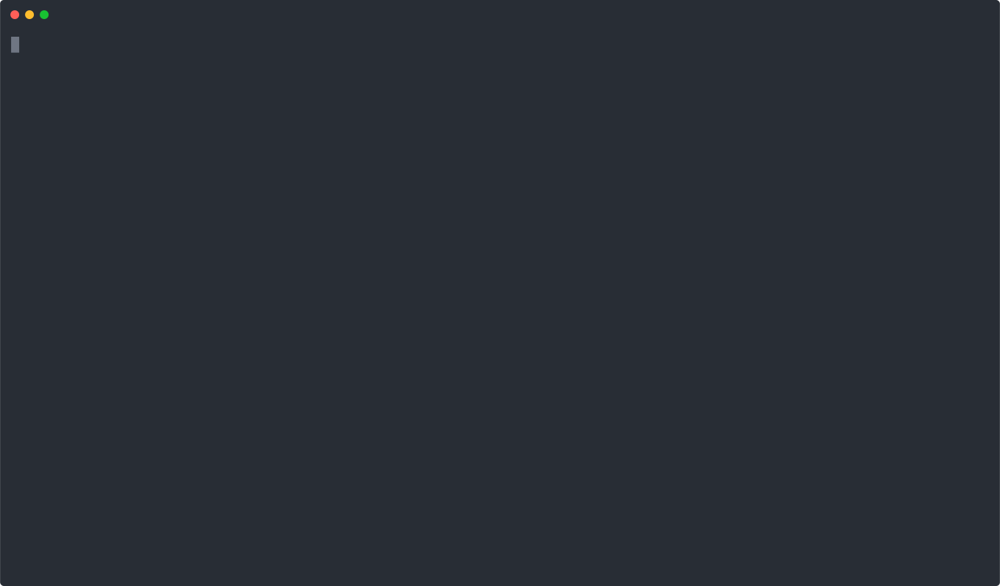

# CHPs Scorer


This tool implements automated checks for the [CHPs specification](https://github.com/chps-dev/chps).

<p align="center">
  
</p>

## Installation

As the scorer has several requirements and is at its heart a funky bash script, it's best to run
using the container image i.e:

```
docker run --privileged ghcr.io/chps-dev/chps-scorer:latest <image_to_scan>
```

Unfortunately, the `--privileged` is required as we're using docker-in-docker.

## Badges

The script will output markdown at the end for creating badges similar to those at the top of
this page. You can then include these in your project pages.

In the future we'd like to create a service that automates badge creation similar to
https://goreportcard.com/. As an interim step, we may look at creating a GitHub Action that updates
READMEs.

## Dependencies

If you want to run the script locally, you will need the following software installed for full
functionality. The scripts have been tested on MacOS, let me know of any issues running in Linux.

- bash
- Docker
- jq (for JSON processing)
- curl (for API requests)
- [crane](https://github.com/google/go-containerregistry/tree/main/cmd/crane) (for size check)
- [cosign](https://github.com/sigstore/cosign) (for signature verification)
- [grype](https://github.com/anchore/grype) (optional, for CVE scanning)
- [trufflehog](https://github.com/trufflesecurity/trufflehog) (for secret scanning)


## Usage

Basic usage:
```bash
./chps-scorer.sh [options] <image>
```

Options:
- `-o json`: Output results in JSON format
- `--skip-cves`: Skip CVE scanning
- `-d <dockerfile>`: Provide a Dockerfile for additional checks

Example:
```bash
# Basic scoring
./chps-scorer.sh nginx:latest

# JSON output with CVE scanning disabled
./chps-scorer.sh -o json --skip-cves nginx:latest

# With Dockerfile for additional checks
./chps-scorer.sh -d Dockerfile myapp:latest
```

## Scoring System

The total maximum score is 20 points, broken down as follows:

- Minimalism: 4 points
- Provenance: 8 points
- Configuration: 4 points
- CVEs: 4 points

Grades are assigned based on the percentage of points achieved.

## Output

The tool provides both human-readable and JSON output formats. The JSON output includes:
- Individual scores for each category
- Detailed check results
- Overall score and grade
- Badge URLs for visual representation

Example JSON output:
```json
{
    "image": "nginx:latest",
    "digest": "nginx@sha256:...",
    "scores": {
        "minimalism": {
            "score": 1,
            "max": 4,
            "grade": "D",
            "checks": {
                "minimal_base": "fail",
                "build_tooling": "pass",
                "shell": "fail",
                "package_manager": "fail"
            }
        },
        ...
    },
    "overall": {
        "score": 10,
        "max": 20,
        "percentage": 50,
        "grade": "C"
    }
}
```
